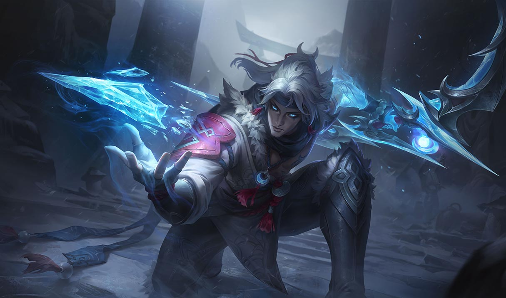
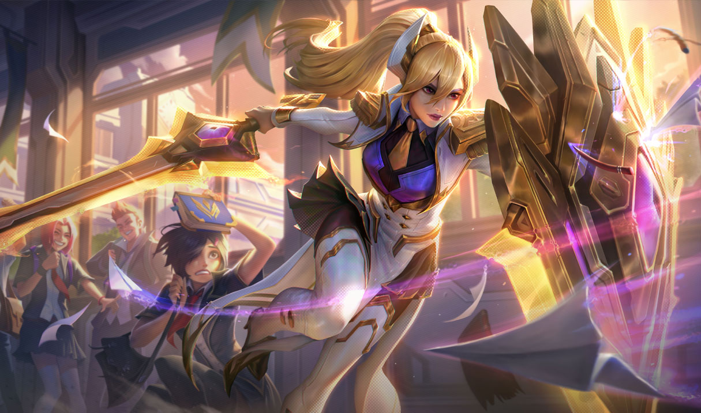

~~~
                                                   .x+=:.        s    
            .uef^"                   ..           z`    ^%      :8    
          :d88E          .u    .    @L               .   <k    .88    
      .   `888E        .d88B :@8c  9888i   .dL     .@8Ned8"   :888ooo 
 .udR88N   888E .z8k  ="8888f8888r `Y888k:*888.  .@^%8888"  -*8888888 
<888'888k  888E~?888L   4888>'88"    888E  888I x88:  `\8b.   8888    
9888 'Y"   888E  888E   4888> '      888E  888I 8888N=*8888   8888    
9888       888E  888E   4888>        888E  888I  %8"    R88   8888    
9888       888E  888E  .d888L .+     888E  888I   @8Wou 9%   .8888Lu= 
?8888u../  888E  888E  ^"8888*"     x888N><888' .888888P`    ^%888*   
 "8888P'  m888N= 888>     "Y"        "88"  888  `   ^"F        'Y"    
   "P'     `Y"   888                       88F                        
                J88"                      98"                         
                @%                      ./"                           
              :"                       ~`    
~~~

TODO: Refactor README.md. there are many notes and thoughts in this readme. please change it, so that they all are at their right place in the wiki. update all the occurances of an idea or concept or event or story beat if you change it at one place or add it. do this chunk of text by chunk of text and ask me after each chunk. when i give green light, we can continue. move the text and enrich it if you think it is necessary, then delete it from readme.md.

# universe

Chryst is a priest in a fantasy world, where magic is real. 

# game

a `TIC-80 javascript with ECS` game about implementing a holy network

the game loop will be:
- story / exposition / dialog
- solve a technical problem with code
- repeat

# random notes

tone will be nordic noir high fantasy
game will be a nordic noir high fantasy visual novel with coding as the gameplay mechanic with levels between story parts

TODO: scan the story and check if the tone is nordic noir high fantasy, if not, give me suggestions to make it more so

TODO: change chrysts brother to be a girl, unrelated to chryst, which he is in love with and grows up with and cannot let go, even after death.
also, he grew up in a team of 3
the third member of the team is a girl, who is in love with chryst, but he does not reciprocate her feelings, because he is in love with the other girl. after he leaves her, she returns as a powerful sorceress later in the story
the team is priest (chryst), hero (girl 1), sorceress (girl 2)

girl 2 theme songs
- i cant get high

Chrysts theme songs will be 
- you dont know what love is
- im a fool to want you
- all alone
- what could have been
-> heavy is the crown

A demacian prince character
- ost: wie jeder andre mann
https://youtu.be/UY3RF8FpCoM
this will be the final addition to the squad
- a friend for styllfried since he is the adult in the group

tymo chryst have a professional relationship and dont talk much, except when necessary. tymo always has a good mood, and chryst thinks he wants to be a good employee, but he just is happy all the time and a little cheeky.
then berlynde joins and she is extra naughty and flirty and chryst is flustered by her presence. she teases him a lot. tymo cringes at her behavior but also finds it funny.
then chryst thinks, we need an adult, someone professional and hires Styllfried.
be he is kinds lonely so chryst completes his squad with 

berlynde tymo chryst are rock paper scissors
berlynde beats tymo, because she can mind control him with brainwashing magic
tymo beats chryst
chryst beats berlynde, because he is 50% immune to mind control, since he has a second heart

could be in the sand kingdom a price who is the (wie jeder andre mann) character, he wants to love his love and travel freely but his father forbids it and he has to stay in the capital, he should be a good mate for styllfried since he is the adult in the group

a kind of darius would be cool. like, he feels bad because he fights with a big axe and kills people to easily. he does not want to kill them, just beat them of have them surrender but they dont and he is forced, since he is/was a soldier/muscle for hire. when having chryst in his party, he can insta heal anyone close to death, and so he can heal his enemies, so he does not have a bad concience anymore.
(i fall in love to easily character, who melancholycally sings about it, while on the battlefield and killing people)
he is the ronin character. a soldier who dreams of being a gardener. (charity)

the seven heavenly virtues
chryst - temperance (he is a workaholic and learns to work life balance and not to get too obsessed with his mission)
tymo - patience berlynde - chastity (she learns to love herself and not to rely on others for validation) 
another girl here (young leona type)
styllfried - diligence (he is lazy and learns diligence through his journey (he is sandbagging and later cares about the mission and fights at his skill level))
long range spellcaster (his other childhood girlfriend)
ronin - kindness (too nice to kill his enemies) 
charity - the childhood friend who stayed behind and is now a master mage

**temperance** (vs gluttony) - **chryst**
**patience** (vs wrath) - **tymo** (he is always happy and never gets angry, also he waits a long time for the right moment to reclaim his homeland without too much bloodshed, this is is big arc and good deed, he is a good guy all around and a sniper who explodes peoples heads at 5000 meters away)
**diligence** (vs sloth) - **styllfried** (he is traumatized and does not want to fight anymore. but he could help the world with his skills. chryst hires him even though he says he will not hurt anyone and only fights with nullifying void magic in the other hand and a big shield in the other hand and only does defense)
**chastity** (vs lust) - **berlynde** (do not seek validation from others, find your self worth from inside)
**kindness** (vs envy) - **ronin** (he is too nice to kill his enemies, which is good. so chryst enables him to fight again since he can prevent them dying by healing them)
**humility** (vs pride) - **astryd** (she is a teenager and like every teenager she is very proud and thinks she knows everything)
**charity** (vs greed) - (placing others needs before your own) - **mimi** (the childhood girl friend who stayed behind and is now a master mage and tsundere and selfish) mimi is a puppeteer mage (like orianna but with ice and snow) she has a move where she puts the ball on a friend (like chryst) and when they go in she detonates it in a way, that does not hurt the friend, but hurts all foes and it is very scary and chryst tells her this but she just shrugs and hmpf and i dont care since she is tsundere with him. with others she is friendly enough but not super warm

mimi (she lives in byswyndt as an immigrant so her name has no y's. this is also why she is not part of the cult of fayth but actually a follower of the cult of elements). when they meet again later, the childhood friend has icy wings from her hips now, like a fairy

NOTE: Please retroactively change the story so that astryd does not stay behind in the city as a priest. she is still a beliver in the cult of fayth but she does not stay behind. she does found the community in this big city and she also is the first beleiver in the cult of fayth. 

these are the fighting people of his squad. in his company there are also
- baumeyster - the bookkeeper and merchant of the group, and later ceo of the electricity company
- a trans programmer type character

his churches will be brutalist since he does not want to waste unecessary money for nice looking buidlings and he nwants to keep how they use the space up to the locals instead of dictating where they sit and where they play, etc

berlyndes passive is to be invisible to anyone not having true sight

1 chryst (support, battlemage)
2 tymo (ranged physical damage, marksman)
3 astryd (melee physical damage/tank, paladin with minimal healing, like from mushoku tensei the girl with red hair gut with a shield)
4 mimi (ranged magic damage, artillery mage)
5 stillfried (main tank, anti-mage)
6 berlinde (magic damage assassin, vision support)
7 ygor (melee physical damage, dive / initiator)

what are the abilities, appearances and relationships of the characters?

chryst abilities
- unholy spells
  - [[invigorate vitae]] (active) - Drinking the blood of a corpse heals the caster's own wounds. The corpse must be freshly killed (dead less than an hour), or else the spell fails to work. Has a much stronger effect if the whole corpse is consumed. 
  - [[heal corpse]] (active) - he can heal a corpse by laying on his hands. 
- holy spells
  - [[healing hands]] (active) - he can heal a person by laying on his hands and transferring fayth into the wound, accelerating the healing process dramatically, the more fayth he puts into it the faster it heals.
  - [[insta heal]] (active) - he can instantly heal a person by casting this spell in their direction.
  - [[banish undead]] (active) - he can banish undead creatures with his holy magic, making them flee or die.
  - [[holy shield]] (active) (janna shield) (called bubble) - he can create a shield of pure fayth energy around himself or an ally, that blocks all damage for a short time. 
  - [[holy shield parry]] (active) - he can parry an attack with his shield, deflecting the blow. 
  - [[judgement smite]] (active) - he can smite a person with holy energy, dealing massive damage to them if they are judged a sinner or undead. 
- holy blade spells (he is the only one who can do this, he invents every spell and technique in this category)
  - [[holy blade]] (passive/active) (kayle e) - he carries a dull sword, but there are runes carved into it that is a holy program code that judges everyone it cuts, and deals more damage the more the person is a sinner and the more fayth chryst puts into the sword at the time of the attack. he can also use ranged attacks that send beams of fayth energy towards his enemy. all fayth magic cannot harm the pure of heart and it will bounce off their pure aura.  
- frozen heart abilities
  - [[frozen heart]] (passive) - chryst carries a second heart to the right next to his own. it is frozen in an icy gem, with runes carved in each face of the gem, which is holy code. there is a scheduler, that makes this heart beat once per week on sundays, to receive and save all the excess fayth that gets accumulated during sunday service. 
    - [[frozen heart - resistance]] (passive) - chryst is 50% resistant to all mind control magic, since he has 2 consciousnesses kinda.
    - [[frozen heart - absorbing magic]] (active) - chryst can absorb some magic that hits him, and convert it into fayth, that gets store in his frozen heart. 
    - [[frozen heart - fayth store]] (passive) - chryst can store fayth in his frozen heart, that can be used to cast spells. 
    - [[frozen heart - emotional coldness]] (passive) - chryst is emotionally cold and distant, and he has a hard time forming emotional connections with others. 
    - [[frozen heart - physically gifted]] (passive) - chryst is normally not physically gifted, but after fusing his brother heart into his body, he is physically gifted, and he is now very strong and fast and can go toe to toe with very strong knights. he is not world class at just sword fighting, and others can beat him but he can trump with magical abilities that he uses in combination with his sword fighting, like the holy sword, holy jetpack shoes, holy shield, etc. 
- holy network/programming abilities
  - [[holy programming]] (active) - chryst can write (prayers) holy programs in the holy (programming) language, that can be used to cast spells, and perform any software task, like scheduling spells, performing calculations. he invents a magic e ink display and a magic split keyboard to interact with the computer. 
  - [[holy tattoos]] (passive) - chryst has holy tattoos on his body, that glow when he casts spells. he tattoos his entire body with holy code, which is a program that improves his ability to cast spells. 
  - [[holy network listener]] (active) - chryst can listen to the holy network, and receive fayth from the people who are praying to him. he hears and feels what they feel, and he can communicate with them telepathically through packets sent over the holy network. the cult of fayth is the religion of love. he can store this fayth energy in his frozen heart. this can make him mentally unstable, since he is constantly bombarded with the emotions of others. 
  - [[DDoS Prayer (Overload)]] (Active): Chryst can aggressively route the emotions and prayers of the "Holy Network" directly into an enemy's mind. It acts like a Distributed Denial of Service attack on their brain, stunning them with sensory overload.
  - [[Open Source Miracles]] (Passive): Because he writes the "code," Chryst can leave temporary "scripts" running in his allies' weapons or armor (e.g., "if health < 10%, cast minor heal").
  - [[Unholy Sandbox]] (Active): For his unholy spells, he isolates a small area of reality like a virtual machine sandbox. Inside this zone, moral laws are suspended, allowing him to use blood magic without corrupting his primary holy code.

berlynde
- shadow magic
  - [[though control]] - she can create powerful illusions that control the minds of others, hallucinations, that no one can see through unless they have true sight. this can be used to stun a person, make them flee, or make them attack their allies. it also makes her passively invisible, since she can passively control every weaker mind to not see her, or alter her appearance in their eyes. she cannot change memories though, just the current perception of the person. 
  - [[touch of death]] - she can kill anyone with a touch, but it costs her her entire life force and she will die too after a while if she is not saved by someone. 
  - [[Sensory Deletion]] (Active): Instead of creating a false illusion, she creates nothing. She targets an enemy and temporarily deletes their sight, hearing, and physical sensation. They don't see a hallucination; they are trapped in a terrifying, silent void.
  - [[Phantom Phobia]] (Active): She reaches into the target's mind, finds their deepest subconscious fear, and overlays it onto her allies. To the enemy, Berlynde's team suddenly looks like terrifying monsters, breaking their formation out of sheer panic.
  - [[Mystifying Miasma]] -the wizard creates a numbing fog that causes lesser foes to listlessly stagger and stumble.
  - [[Mist of Shadows]] - The Wizard envelops the battlements with choking cloud of magical darkness. When the mysterious fog dissipates, there is no one to be seen.
  - [[Okkam's Mindrazor]] - The wizard summons phantasmal weapons for his allies that shred the folds of consciousness and reason. Victims of these mindrazor believe themselves slain, and are stunned.

tymo
- alteration magic
  - [[change material]] (active) - tymo can change the material of any object he touches, into any other material. this can be used to turn a sword into a whip, a shield into a sword, etc. depending on the transformation it costs him more or less mana.
  - [[alter body]] (active) - tymo can alter his body to be stronger, faster, more durable, etc. depending on the transformation it costs him more or less mana.
  - [[advanced materials]] - he can create ultra advanced materials, like nano tubes, graphene, etc. and creates guns, and other advanced weapons 
  - [[Kinetic Metamaterial]] (Passive): Tymo alters his clothing into a theoretical material that absorbs kinetic energy. When an enemy hits him, the material hardens. He can then release that stored energy into his own muscles (Alter Body) to drastically increase his agility for a short burst.
  - [[Phase Traps]] (Active): He alters the density of the ground so it temporarily becomes like a non-Newtonian fluid. Enemies step into solid rock, sink like it's water, and then he snaps the material back to solid, trapping them at the knees.
- inventor skills
  - [[gunsmithing]] (active) - tymo can create guns, and other advanced weapons. 
  - [[Graphene-Weave Cloak]] (Passive): Using alteration magic, Tymo creates a cloak that mimics the fur of a mythical Fenris-wolf but is structurally reinforced with carbon nanotubes. It makes him functionally immune to all "cold-debuffs". he invents tech wear from first principles
  - [[The Silent Lead]] (Active): He invents a "Suppressed" rail gun sniper rifle by altering the air pressure inside the barrel with alteration and fayth holy magic programming runes on the barrel to be a vacuum. When he fires, there is no sound—only the sight of an enemy falling over in the snow as a heavy, graphene-tipped slug finds its mark.
- hunter skills
  - [[hunter's bow]] (active) - tymo can use a bow and arrow to shoot enemies from a distance. 
  - [[sniper rifle]] (active) (he invents this with alteration magic) - tymo can use a sniper rifle to shoot enemies from a distance. 
  - [[hunter's senses]] (passive) - tymo has enhanced senses, that allow him to detect enemies from a distance. also he will almost never step into traps and can detect traps and ambushes. 
  - [[hunter's trap]] (active) - tymo can set traps for enemies. 
  - [[hunter's stealth]] (passive) - tymo can move silently and undetected. and he can also turn invisible after preparing for a while 
  - [[hunter's tracking]] (active) - tymo can track enemies by reading their footprints and other traces they leave behind. 
  - [[hunter's agility]] (passive) - tymo is very agile and can dodge attacks easily. he is not physically gifted, which is a special trait that some people have. if you are not physically gifted, you cannot fight melee with someone who is physically gifted, they are superman compared to you. tymo however is almost as strong as someone who is physically gifted, because he can alter his body to be stronger, faster, more durable, etc. and he has the hunters agility. 
- good mood
  - [[good mood]] (passive) - tymo is in a good mood, and he is happy and cheerful. he has the right philosophy of inner freedom, that the outer circumstances do not matter for your inner peace. 
  - [[Sisu Philosophy]] (Passive): An expansion of [[Good Mood]]. It’s no longer just "cheerful"—it’s Sisu (Finnish stoicism). No matter how much damage Tymo takes, his "Inner Freedom" prevents him from feeling fear or pain-shock, allowing him to operate at 100% efficiency until his heart literally stops.

- astryd
  - noxus paladin abilities (she fights with sword and shield, she is more of a tank with a little damage, and she is very loyal to the noxus empire)
    - ideas please

- mimi
  - elementalist ice mage spells (she does not cast regular ice spells but creates shards of ice and ice mirrors that reflect light. she can compress water to create a bright flash of light that blinds enemies, and can manipulate this beam of light with her mirrors, this takes some time to set up but when it is ready it is very powerful artillery blast)
    - [[artillery mage]] (active) - mimi can cast spells that deal damage to enemies from a distance. 
    - [[splash damage]] (active) - mimi can cast spells that deal damage to enemies in an area. 
    - [[flashbang]] (active) - mimi can create a flash of light that blinds enemies. 
    - [[ice mirror]] (active) - mimi can create mirrors of ice that reflect light and confuse enemies. 
    - [[ice sniper]] (active) - mimi can create a beam of light that deals damage to enemies in a line, this is her ultimate ability and it takes a while to charge up, like lux ulti. 
    - [[ice trap]] (active) (lissandra w) - area of effect slow and root 
    - [[ice cage]] (active) (lissandra r) - mimi casts a cage of ice around herself, freezing her in place but making her invulnerable and dealing damage to enemies around her. this is her panic button.  
    
- ygor
  - samurai magic sword fighter (physically gifted)
    - [[dual wield]] (passive) - ygor can use two katanas to fight enemies. 
    - [[blink slash]] (active) (yone ult) - ygor can dash in a line, dealing damage to enemies in his path. this is hard engage
    - [[recall to blade]] (active) (yone e) - ygor can set his blade in the ground and later recall to his blade. this is disengage
  - fayth magic empowered swords
    - [[judging slash]] (active) (yone e) - ygor slashes an enemy and cuts them if the sword deems them a sinner, but bounces off if they have a pure heart 

- styllfried
  - void mage
    - [[nullify spell]] (active) - styllfried can nullify spells that are cast near him.
    - [[resist magic]] (passive) - styllfried has a high passive resistance to all schools of magic. he is also resistant to berlyndes mind control magic 
  - big shield
    - [[big shield]] (passive) - styllfried carries a big shield that blocks physical damage. 
    - [[Event Horizon]] (Passive): His big shield isn't just heavy metal; it contains a miniature void singularity. The shield actually bends the trajectory of nearby magical projectiles, sucking them into the center of the shield to protect allies standing near him.
    - [[Silence the Room]] (Active): Styllfried slams his shield into the earth, creating a massive, suffocating dome of absolute void energy. Inside this dome, no magic can exist. All active spells are canceled, and no one (not even his allies) can cast magic. It forces everyone in the area into a pure, gritty melee brawl—where the guy with the biggest shield usually wins.

combos
[[Prismatic Nightmare]] (Mimi + Berlynde): Berlynde creates an illusion of a terrifying shadow monster. Mimi fires her [[Prism Cannon]] directly into the illusion. The glass magic refracts the shadow, turning one phantom into a hundred terrifying, blindingly bright clones that inflict actual burn damage from the trapped light.

relationships / scenes together / meet cutes

Chryst this but male 
![[Pasted image 20260428004511.jpg]]

Tymo this but male

astryd is a young leona type character

Mimi
![[Pasted image 20260428005954.jpg]]

Styllfried
![[Pasted image 20260428010054.jpg]]

Berlynde 
![[Pasted image 20260428010309.jpg]]

Ygor
![[Pasted image 20260428004205.jpg]]

https://www.youtube.com/watch?v=nfIVcY-YtIY

a royal paladin lady teenager, that has to do a real mission for the first time to be certified as paladin (shield and sword tank)

Tymo has to do a spy/recon mission, almost dies and they hire Berlynde as a result
tymo: uzi mit schalldämpfer sie ist fast so groß wie ich because he is a halfling and sniper

twisted fate

TODO: osts/themes for each character

## levels

### level 0 - tutorial

(dan harmon story circle "you")

(Chryst origin story, how he discovers that he can write prayers as programs and the stuff in the programs actually comes true. Step by step he discovers it and this will be the tutorial steps.)

Once, men coexisted with each other.
They shared peace forged in wisdom,
a peace, that lasted many generations.

### level 1 - one node

#### plot

see: [[Chapter - Bysfrost]]

#### gameplay

tower defense as programming
the user has to defend a node from monsters.

the code will look like this:
if enemy is in detection radius
emit enemy distraction signal (this takes power from capacity)

### level 2 - two nodes

a second node is added, and the user now has the ability to send messages and power from one node to another and.

the message system uses a message stack that can be read when the code runs in the specific tick.

the code system has to be hard capped by ms per invocation. (this is mana maybe)
if an invocation takes more than 16ms, the node will be disabled and has to be re-enabled. (this has to happen with a worker, later, now it can be done by the player with a cooldown period, click enable and then wait 10 seconds for it to boot)

the algorithm can be:
if their_capacity_percentage is higher than my_capacity_percentage than dont send power, else send power.

if monster in radius: deter monster based on distance, if it is closer, than send more power to it.

### level 3 - multiple nodes in a line

the user has to implement routing in a line with message passing

### level 4 - multiple nodes in a grid

the user has to implement routing in a grid with message passing based on an algorithm like packet flooding

## game design

it has three gameplay systems

### dialog system

this game has a plot and characters, and you can talk to them to advance the plot. this is also how the player gets exposition.

the player can choose what to say, and the characters will react accordingly. this will affect the plot.

there exists a reputation system, where each kingdom / faction has a reputation with the player. this will affect the plot. if the player chooses correct dialogue options, the reputation will increase. if the player chooses incorrect dialogue options, the reputation will decrease. 
consequences of high reputation: 
- the territory gets unlocked for the player on the map (maybe with some caveats for certain territories)
- in undertale, the player can be pacifist or genocidal, here it is somewhat the same. the player can choose to be a ruthless capitalist, and provide power grid services to everyone or exclude ruthless dictator states from the power grid. TODO what are the consequences of this? 

TODO: implement dialog system

### mechanic: power system

each node generates power each tick, based on the node size.
each node has a base demand of power each tick.
normally, the generation is higher than the demand, so the node has a surplus of power.
each node has a capacity, and can store power. 
each node can spend a little or a lot of power to deter monsters
each node can send power to other nodes, based on the connection radius.
each node can receive power from other nodes, based on the connection radius.
in later levels, the player can run different functions on the nodes like making the node invisible to monsters.

### code runner system

TODO: implement code editor 

the user has to solve technical problems with clever software engineering.

the users code for each node runs every tick
the user has to schedule to run at the fewest ticks possible to save power
it is a level system, where one problem after another has to be solved.
the problems fit together and one builds on the next.

### worker management system

#### automated repairs

if a node gets destroyed by monsters or blows up because of the 16ms timeout, the player can send workers to repair it. 

at first this has to be done manually by the player, but later it can be automated with workers.

this is code on a worker central, a different type of node, that can automate workers
if a node is damaged, it will send a message to the worker central, and the worker central will send workers to repair it.
algorithm:
if node is damaged:
  send message to worker central

worker central:
  if message in stack:
    send workers to repair it

TODO: implement business logic code editor 
TODO: implement worker management status system like rollercoaster tycoon
