# Game Design

# Screen Flow / Plot

## splash screen

2026

chuu-p Presents

## title screen

Title Screen - (Press Start)

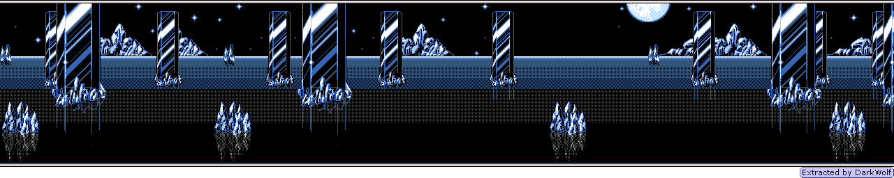
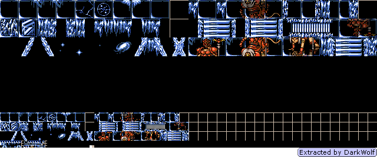

## Select Game 

Menu
- New Game
- Load Game

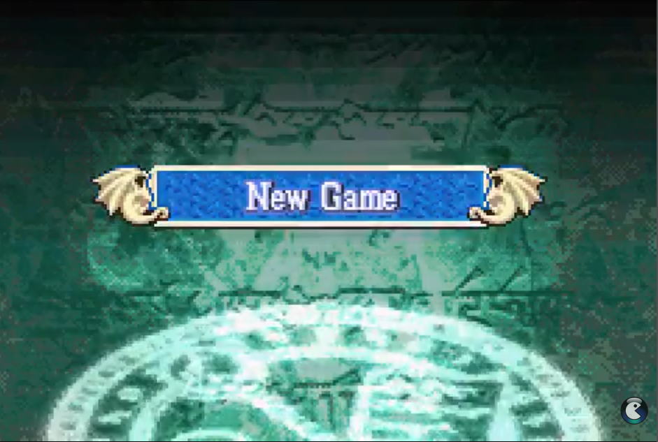

## (if new game) New Game Screen 

Heading: New Game

Slot 1: --NO DATA--
Slot 2: --NO DATA--
Slot 3: --NO DATA--

Footer bottom right: Play Time 0:00.00 (calculated from t in world in save file)

after selecting the save file will represent the current level / chapter
Prologue: A land over the icy sea.
Chapter 1: Byswyndt, the first church.

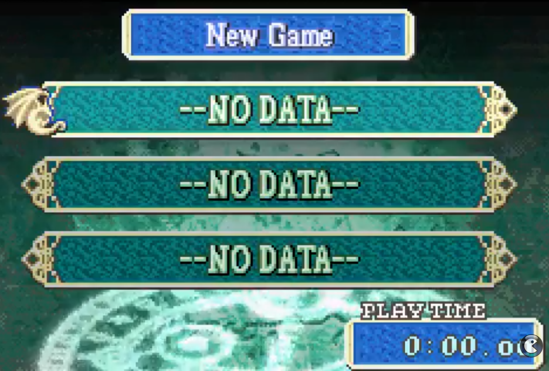
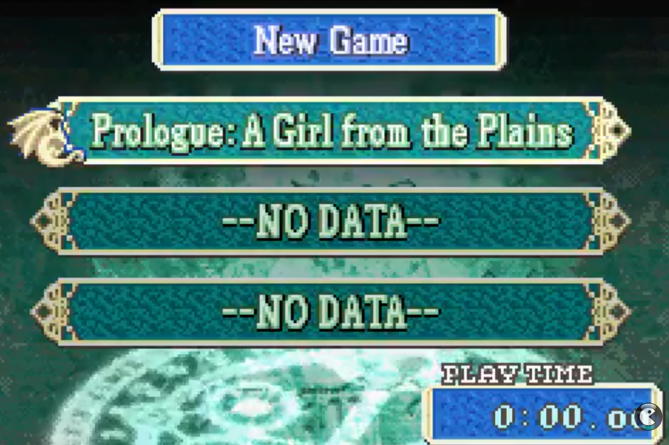

## Prologue: A land over the icy sea.

A transition "Start Chapter" screen

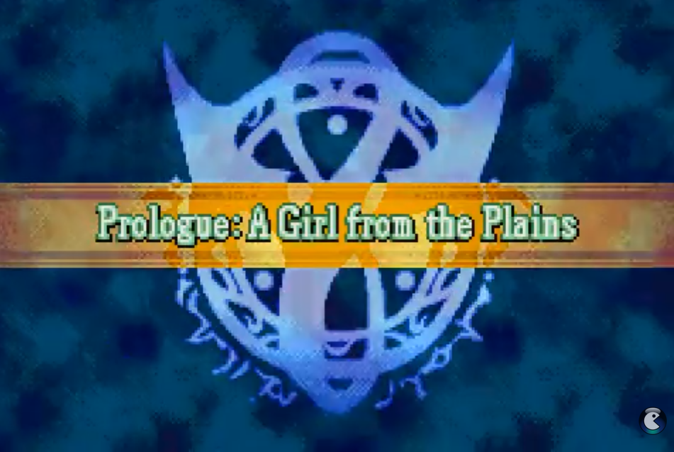

## (if new game) Prologue Cut Scene (Lore Exposition) Screen

Once, dragons and men ...

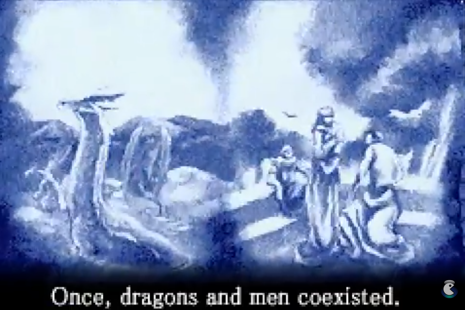

## (if new game) onboarding showcase

the story starts in Yswyndt, this is the tutorial stage and the start of the story

(if first boot) Character presentation - (A)
(show combat types)

(Priest / Cult of Fayth)
**Helfrych**, an apprentice priest in training from Yswyndt.
Priests of Fayth are mages who can heal, bless and banish undead.

(Hero / Cult of Fayth)
**Carolyn**, childhood friend of Helfrych training swordfighting.
Heroes are celebrated for their selflessness in protecting humanity.

(Priest / Cult of Elements)
**Mimi**, childhood friend of Helfrych training elemental magic.
Priests of Elements are mages who can control the elements.

(Priests / Cult of Death)
**Fyrchtegott**, the Yswyndt village priest and mentor for Helfrych.
Priests of Death are mages who can give and take life force.

(Monk / Cult of Shadows)
**Berlynde**, a cold general wielding the Obsidian Aegis.
A shadow mage who keeps others at distance through terror.

---

(Arbiter / Cult of Fayth)
**Chryst**, a priest turned hero carrying 2 souls in a frozen heart.
A holy blade wielder on a mission to build a global Fayth network.

(Vanguard / Cult of Shadows)
**Axtritt**, a noble woman having to prove herself as a Maxt knight.
A sword and shield wielder for whom .

(Marksman / Cult of Gold)
**Tymo**, a halfling hunter and alteration mage from Syrvann.
A cheerful sniper who waits patiently to free his homeland.

---

(Slayer / ?)
**Ygor**, a prince from the kingdom of X longing for a free life.
Slayers can use blink slashes and hard engage their enemy.

---

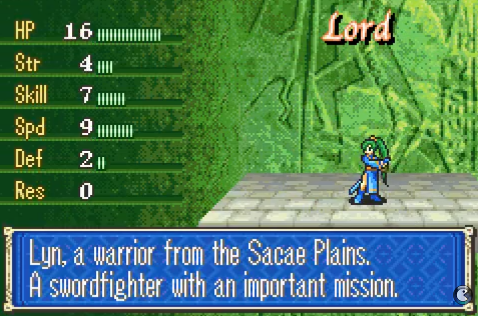

### Prologue Dialog

??: Are you awake?
Girl: I found you unconscious on the plains.
Lyn: I am Lyn, of the Lorca tribe. You're safe now.
Lyn: Who are you? Can you remember your name?
...
Lyn: What was that noise? Lets check it out

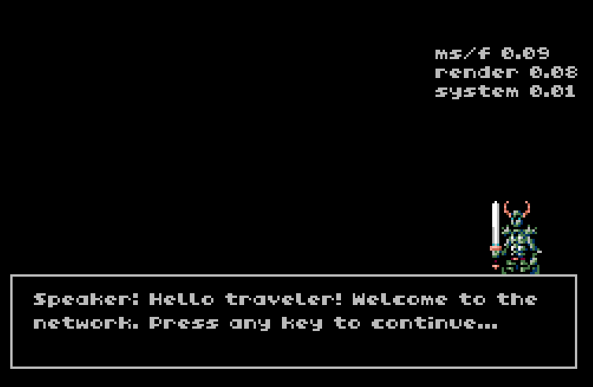

# Map movement interaction mini-game

There are nodes (locations) on the map.
The player can place his party (at the start just Helfrych) at one node and interact with it, like deploy code to, fight enemy, repair, etc.

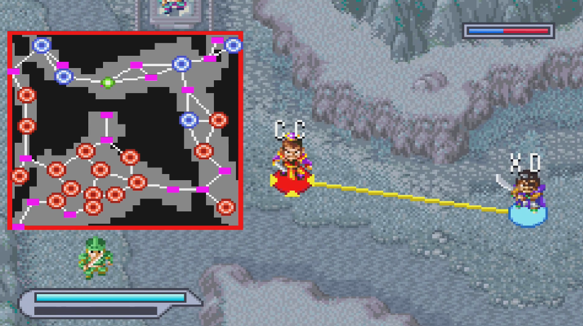

# Fighting mini-game

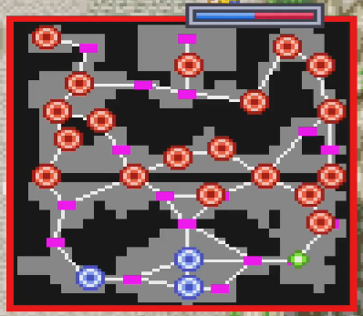

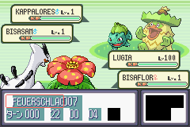

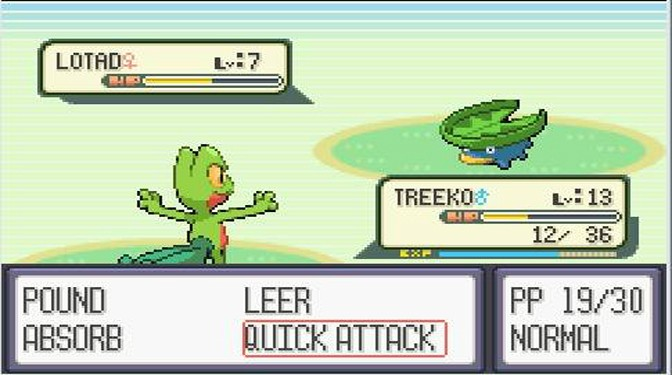

Pokemon like fighting mini game
Helfrych and Carolyn vs Monsters in the forest
Helfrych and Carolyn vs Maxt army 
Helfrych and Carolyn vs Berlynde

# Coding mini-game

## Overview
A progressive coding challenge mini-game where the player builds a decentralized mesh network node by node. Each level introduces new mechanics through coding tasks, reinforcing the theme of "Chryst building this network one node after another."

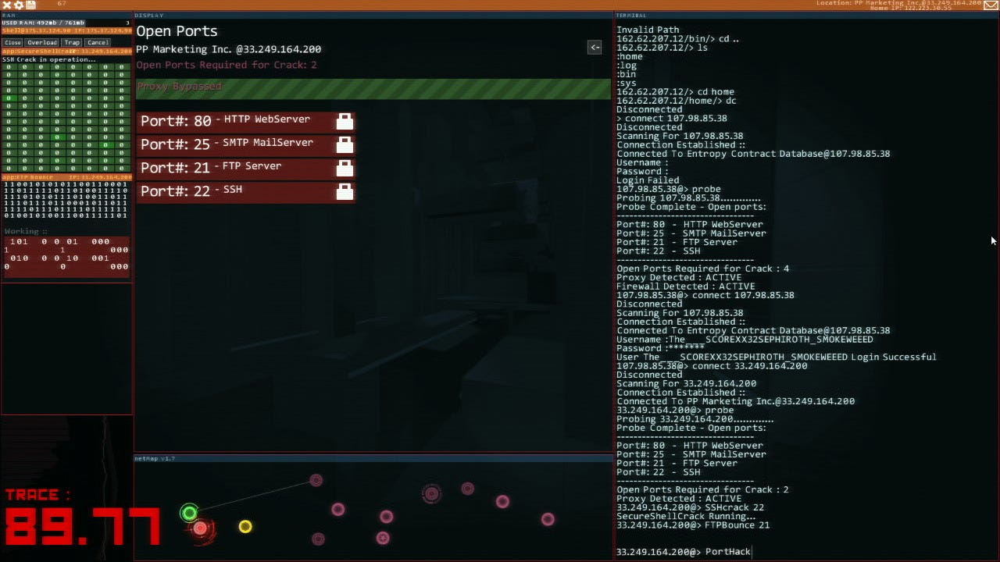

## Interface

When a player selects a node and chooses the "code" option, the player will be presented with a text based interface to code the node.

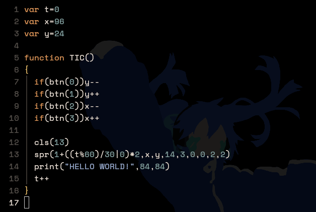
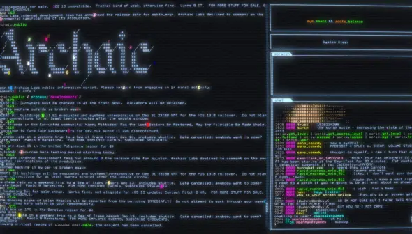

## Core Mechanics

Power balancing

Manage the power by reading and setting capacity production demand, etc. 
Later balance over multiple nodes 

node view
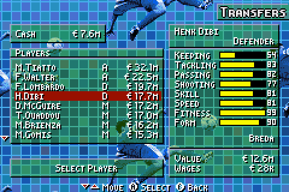

# levels

Level 0
Tutorial

Level 1
One node functions the player has to implement:
Database functions (message log/power ledger) (this will be used for graphs, has to be implemented as a kind of storage for each node)
Power balancing functions (how much to open the capacity to supply the demand)

Node has 2 storages, the code storage and the persistent memory

Other node
Deployment receiving - a function that takes a message, and writes the code to the code storage of the node, so that on the next tick, this new code runs

T has to be part of world and save/load game will be just world serialized and deserialized 
### Message Passing
- **Introduction**: Early levels (1-3)
- **Concept**: Nodes communicate by passing messages through the network
- **Test Requirements**: Messages reach intended destinations, routing is correct

### Power Passing
- **Introduction**: Mid levels (4-6)
- **Concept**: Nodes can send and receive power/energy across connections
- **Test Requirements**: Power distribution is balanced, no nodes are starved

### Routing Algorithms
- **Introduction**: Later levels (7+)
- **Concept**: Implement specific routing strategies to solve complex network problems
- **Difficulty Progression**: Simple → Medium → Hard

---

## Level Progression

### Phase 1: Foundations (Levels 1-3)

#### Level 1: Single Connection
**Theme**: Chryst's first node reaches out

- **Objective**: Create two nodes and establish direct communication
- **Task**: Implement a basic `send_message()` function that passes a message from Node A to Node B
- **Concepts Introduced**:
  - Node structure
  - Direct message passing
  - Basic network connection
- **Test Cases**:
  - Message sent from A arrives at B unchanged
  - Message content is preserved
  - Multiple messages can be sent in sequence
- **Victory Condition**: All tests pass ✓

---

#### Level 2: Triangle Network
**Theme**: Chryst connects a third node to the growing network

- **Objective**: Build a 3-node network where messages can route through intermediate nodes
- **Task**: Implement `route_message()` that finds the correct path from source to destination
- **Concepts Introduced**:
  - Network topology with intermediate nodes
  - Basic routing (direct and one-hop)
  - Node addressing/identification
- **Test Cases**:
  - A → B (direct)
  - A → C (through B)
  - C → A (reverse path)
  - Message headers include source/destination IDs
- **Victory Condition**: All tests pass ✓

---

#### Level 3: Mesh Network Foundation
**Theme**: The network grows—Chryst adds more nodes, creating redundant paths

- **Objective**: Handle a 5+ node network with multiple possible routes
- **Task**: Implement `find_all_paths()` and choose the shortest path
- **Concepts Introduced**:
  - Network discovery
  - Path selection logic
  - Graph traversal basics
- **Test Cases**:
  - Identify all possible paths between two nodes
  - Select the shortest path
  - Handle nodes with multiple connections
  - Route around a broken connection
- **Victory Condition**: All tests pass ✓

---

### Phase 2: Power Distribution (Levels 4-6)

#### Level 4: Power Introduction
**Theme**: Chryst discovers nodes need energy to relay messages—introducing power passing

- **Objective**: Implement power distribution alongside message passing
- **Task**: Create a `distribute_power()` function that sends power from a central node
- **Concepts Introduced**:
  - Power/energy as a resource
  - Power drains from relaying messages
  - Power tracking per node
- **Test Cases**:
  - Power flows from source to all connected nodes
  - Each relay costs power
  - Nodes with insufficient power cannot relay
  - Power values are correctly decremented
- **Victory Condition**: All tests pass ✓

---

#### Level 5: Balanced Distribution
**Theme**: Chryst learns that efficient power distribution prevents network collapse

- **Objective**: Distribute power optimally across a network where all nodes need to remain active
- **Task**: Implement `optimize_power_routing()` to ensure no node runs out of power
- **Concepts Introduced**:
  - Load balancing
  - Priority-based distribution
  - Failover detection
- **Test Cases**:
  - All nodes maintain minimum power threshold
  - Power is prioritized to high-traffic nodes
  - Network detects and reports power-starved nodes
  - Messages can still route even under power constraints
- **Victory Condition**: All tests pass ✓

---

#### Level 6: Dual Mechanics Integration
**Theme**: Messages and power now flow simultaneously through Chryst's network

- **Objective**: Combine message passing and power passing in a single, cohesive system
- **Task**: Implement `send_message_with_power()` that routes messages while managing power consumption
- **Concepts Introduced**:
  - Resource management during message routing
  - Fallback routing when power is low
  - Network resilience
- **Test Cases**:
  - Messages route successfully while power depletes
  - Network adapts routes when power becomes critical
  - Power regeneration (optional) or power sources are balanced
  - Network continues functioning under stress
- **Victory Condition**: All tests pass ✓

---

### Phase 3: Routing Algorithms (Levels 7+)

#### Level 7: Flooding (Introduction)
**Theme**: When simple routing fails, Chryst broadcasts everywhere—brute force method

- **Objective**: Implement **Packet Flooding** for broadcast/discovery
- **Task**: Create `flood_network()` that broadcasts a message to all nodes
- **Concepts Introduced**:
  - Broadcast messaging
  - Hop counting to prevent infinite loops
  - Message tracking (seen IDs)
- **Test Cases**:
  - Message reaches all nodes
  - No infinite loops (messages don't cycle)
  - Hop limit prevents network congestion
  - Flooding efficiency metrics recorded
- **Victory Condition**: All tests pass ✓
- **Difficulty**: Medium (first algorithm to implement)

---

#### Level 8: Greedy Routing
**Theme**: Chryst learns to make smart decisions—always move closer to the target

- **Objective**: Implement **Greedy/Closest Neighbor Routing**
- **Task**: Create `greedy_route_message()` that selects the neighbor closest to destination at each hop
- **Concepts Introduced**:
  - Geographic/logical distance metrics
  - Node coordinates or network positions
  - Greedy algorithm trade-offs
- **Test Cases**:
  - Messages consistently route toward destination
  - Greedy routing handles local optima gracefully
  - Compare efficiency vs. shortest-path routing
  - Works in sparse and dense networks
- **Victory Condition**: All tests pass ✓
- **Difficulty**: Easy

---

#### Level 9: Spanning Tree Routing
**Theme**: Chryst creates a backbone—an efficient tree structure for the network

- **Objective**: Implement **Spanning Tree** based routing (like in STP/RSTP)
- **Task**: Build and maintain a `spanning_tree()` for optimal message delivery
- **Concepts Introduced**:
  - Tree data structures
  - Loop prevention
  - Root node selection
  - Efficient backbone networks
- **Test Cases**:
  - Tree structure has no cycles
  - All nodes are reachable from root
  - Root election works correctly
  - Bridge selection follows priority rules
  - Network reconverges when topology changes
- **Victory Condition**: All tests pass ✓
- **Difficulty**: Medium

---

#### Level 10: Directed Diffusion / Interest-Based Routing
**Theme**: Nodes announce what they want—Chryst builds pull-based networks instead of push

- **Objective**: Implement **Interest-Based Routing** where nodes express interest in data
- **Task**: Create `register_interest()` and `propagate_data()` for targeted delivery
- **Concepts Introduced**:
  - Interest/subscription model
  - Reverse path forwarding
  - Efficient data dissemination
  - Query-response patterns
- **Test Cases**:
  - Interest propagates backward through network
  - Data flows only to interested nodes
  - Multiple interests are handled correctly
  - Reinforcement of good paths over time
- **Victory Condition**: All tests pass ✓
- **Difficulty**: Medium-Hard

---

#### Level 11: Dynamic Source Routing (DSR)
**Theme**: Chryst controls the entire path—knowledge is power

- **Objective**: Implement **Dynamic Source Routing** where sender specifies the complete path
- **Task**: Create `discover_route()` and `send_via_route()` functions
- **Concepts Introduced**:
  - Route discovery and caching
  - Complete path encoding in messages
  - Route maintenance and repair
  - Feedback mechanisms
- **Test Cases**:
  - Route discovery finds valid paths
  - Route cache prevents redundant discoveries
  - Messages follow specified routes exactly
  - Network detects and handles broken links
  - Alternative routes are tried on failure
- **Victory Condition**: All tests pass ✓
- **Difficulty**: Medium-Hard

---

#### Level 12: AODV (Ad-Hoc On-Demand Distance Vector)
**Theme**: The ultimate challenge—Chryst implements a professional-grade routing algorithm

- **Objective**: Implement **AODV** routing protocol
- **Task**: Create `aodv_route_discovery()`, `aodv_send_message()`, and `handle_link_failure()`
- **Concepts Introduced**:
  - Sequence numbers for loop prevention
  - Reverse path setup
  - Forward path establishment
  - Hello messages for neighbor discovery
  - Route error (RERR) propagation
- **Test Cases**:
  - Routes discovered on-demand
  - Sequence numbers prevent routing loops
  - Link failures trigger RERR messages
  - Network converges after topology changes
  - Routing overhead is reasonable
  - All messages reach destinations correctly
- **Victory Condition**: All tests pass ✓
- **Difficulty**: Hard

---

## Level Difficulty Curve
 
